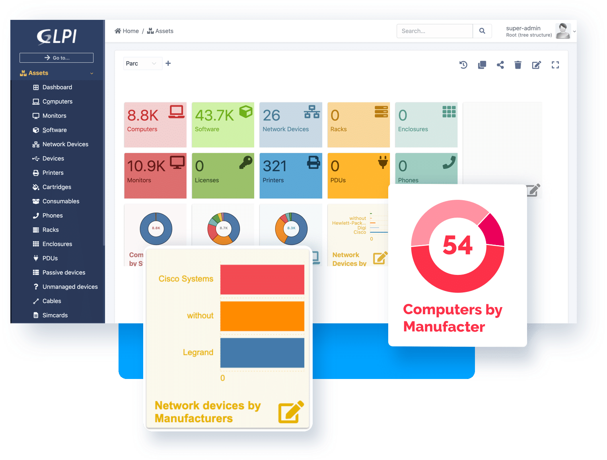

# 📂 PROYECTO INTERMODULAR: Gestión de Incidencias TIC para Aula Taller (GLPI)




- [📂 PROYECTO INTERMODULAR: Gestión de Incidencias TIC para Aula Taller (GLPI)](#-proyecto-intermodular-gestión-de-incidencias-tic-para-aula-taller-glpi)
  - [📋 1. Ficha Técnica del Proyecto](#-1-ficha-técnica-del-proyecto)
  - [🗓️ 2. Planificación Temporal (Cronograma)](#️-2-planificación-temporal-cronograma)
    - [**Semana 1: Planificación y Preparación (10 horas)**](#semana-1-planificación-y-preparación-10-horas)
    - [**Semana 2: Desarrollo Técnico (20 horas)**](#semana-2-desarrollo-técnico-20-horas)
      - [💻 A. Instalación del Servidor (Ubuntu Server 22.04 LTS)](#-a-instalación-del-servidor-ubuntu-server-2204-lts)
      - [🌐 B. Configuración de Red y GLPI](#-b-configuración-de-red-y-glpi)
    - [**Semana 3: Pruebas y Documentación (12 horas)**](#semana-3-pruebas-y-documentación-12-horas)
      - [🧪 Pruebas de Funcionamiento](#-pruebas-de-funcionamiento)
      - [📄 Documentación Entregable](#-documentación-entregable)
    - [**Semana 4: Exposición y Evaluación (6 horas)**](#semana-4-exposición-y-evaluación-6-horas)
  - [📊 3. Sistema de Evaluación](#-3-sistema-de-evaluación)
    - [Matriz de Competencias](#matriz-de-competencias)
    - [Rúbrica de Evaluación Simplificada](#rúbrica-de-evaluación-simplificada)
  - [🔗 4. Anexos Técnicos y Mejoras](#-4-anexos-técnicos-y-mejoras)
    - [Diagrama de Red Simplificado](#diagrama-de-red-simplificado)
    - [Posibles Mejoras Futuras](#posibles-mejoras-futuras)

**Proyecto:** "Implantación de un Sistema de Gestión de Incidencias para el Aula Taller de Informática" 

Este proyecto simula un escenario realista ejecutable en 50 horas, integrando módulos de Redes, Sistemas Operativos y Ofimática.

---

## 📋 1. Ficha Técnica del Proyecto

| Aspecto | Detalles |
| --- | --- |
| **Título** | Sistema de Gestión de Incidencias TIC para Aula Taller |
| **Duración** | 50 horas |
| **Equipo** | 3 alumnos |
| **Software Principal** | GLPI (Software Libre) |
| **Hardware** | 1 servidor, 3 equipos cliente, switch, cableado |
| **Cliente** | Departamento de Informática del Centro Educativo |

---

## 🗓️ 2. Planificación Temporal (Cronograma)

### **Semana 1: Planificación y Preparación (10 horas)**

**Objetivos:** Análisis de requisitos y división de roles.

* **Análisis de Requisitos:**
* Identificar incidencias comunes (pantallazos azules, virus, red).


* Definir usuarios (profesores, alumnos) y datos a registrar.


* Investigar GLPI y alternativas.


* **Roles del Equipo:**
* 👤 **Alumno 1:** Instalación del servidor.


* 👤 **Alumno 2:** Configuración de red.


* 👤 **Alumno 3:** Documentación y manuales.


* **Presupuesto Estimado (Coste Real: 0€):**
* Servidor y Software GLPI: **0€** (Reutilizado/Open Source).


* Valoración del tiempo técnico: 30h x 20€/h = **600€** (Estimado).


---

### **Semana 2: Desarrollo Técnico (20 horas)**

**Objetivos:** Instalación del núcleo del sistema y configuración de red.

#### 💻 A. Instalación del Servidor (Ubuntu Server 22.04 LTS)

Se prepara un equipo (Pentium IV o superior, 4GB RAM) y se instalan los servicios LAMP:

```bash
# Instalación de dependencias
sudo apt update
sudo apt install apache2 mariadb-server php php-mysql libapache2-mod-php

# Descarga e instalación de GLPI
wget https://github.com/glpi-project/glpi/releases/download/10.0.7/glpi-10.0.7.tgz
tar -xzvf glpi-10.0.7.tgz
sudo mv glpi /var/www/html/

```


#### 🌐 B. Configuración de Red y GLPI

- **IP Fija Servidor:** `192.168.1.100`.

- **Acceso Web:** `http://192.168.1.100/glpi`.

- **Categorías de Incidencias:** Hardware, Software, Red, Sistema Operativo .

 
- **Base de Conocimiento:** Creación de artículos como "Cómo resetear contraseña" o "Solución error 0x0000007B" .


---

### **Semana 3: Pruebas y Documentación (12 horas)**

**Objetivos:** Validar el sistema y generar los entregables escritos.

#### 🧪 Pruebas de Funcionamiento

Se simulan incidencias reales para verificar el flujo:

1. **Incidencia:** "Ratón del equipo A3 no funciona" → **Solución:** Cambiar puerto USB.


2. **Incidencia:** "Equipo B5 sin conexión" → **Solución:** Revisar cable de red.


3. **Incidencia:** "Office no abre" → **Solución:** Reparar instalación.


#### 📄 Documentación Entregable

**Memoria Técnica (8 páginas):** Incluye análisis, desarrollo paso a paso y resultados .


* **Manual de Usuario Rápido:**
> **Para reportar incidencia:**
> 1. Acceder a `http://192.168.1.100/glpi`.
> 2. Login con usuario alumno.
> 3. Click en "Nueva incidencia", describir y enviar .
> 
> 


---

### **Semana 4: Exposición y Evaluación (6 horas)**

**Objetivos:** Defensa del proyecto ante el tribunal.

* **Estructura de la Presentación (20 min):**
* 10 min: Presentación (Problema vs Solución GLPI).


* 05 min: Demostración en vivo.


* 05 min: Preguntas y respuestas.


---

## 📊 3. Sistema de Evaluación

### Matriz de Competencias

| Competencia | Evidencia | Peso |
| --- | --- | --- |
| **Planificación** | Gantt, presupuesto, tareas | 25% |
| **Ejecución Técnica** | Servidor, GLPI y red operativos | 35% |
| **Documentación** | Memoria, manual y presentación | 20% |
| **Defensa Oral** | Claridad y dominio técnico | 15% |
| **Trabajo en Equipo** | Participación y resolución conflictos | 5% |

### Rúbrica de Evaluación Simplificada

| Criterio | Avanzado 10 | Intermedio 7.5 | Básico 5 | Necesita Mejorar 0 |
| --- | --- | --- | --- | --- |
| **Funcionalidad** | Todo funciona perfectamente | Funciona con pequeños errores | Funciona parcialmente | No funciona |
| **Documentación** | Completa y profesional | Adecuada pero mejorable | Básica pero suficiente | Incompleta o muy deficiente |
| **Presentación** | Clara, convincente, buen ritmo | Clara pero monótona | Se entiende pero falta fluidez | Confusa, desorganizada |
| **Trabajo equipo** | Excelente coordinación | Buena coordinación | Coordinación aceptable | Poca o nula coordinación |

---

## 🔗 4. Anexos Técnicos y Mejoras

### Diagrama de Red Simplificado

```text
[INTERNET] → [Router] → [Switch]
                           ↓
                [Servidor GLPI (192.168.1.100)]
                           ↓
        [Cliente 1] -- [Cliente 2] -- [Cliente 3]

```


### Posibles Mejoras Futuras

* 📧 Integración con correo para notificaciones automáticas.

* 📱 App móvil para reportes con fotos.

* 📊 Dashboard con estadísticas mensuales.

---

> **💡 Consejos para el Equipo:**
> * **Documentad TODO:** Cada error y solución cuenta.
> * **Backups:** Haced copias de seguridad antes de cambios importantes.
> * **Ensayo:** Practicad la presentación y anticipad preguntas difíciles.
