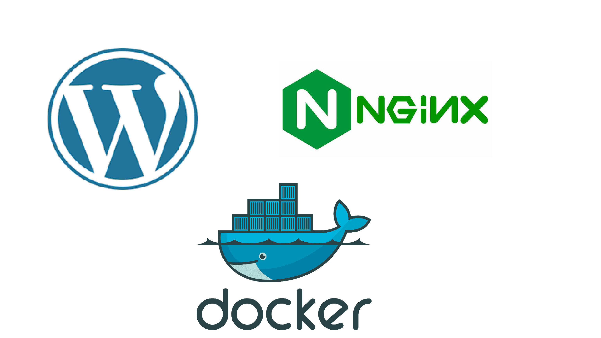

# 📂 PROYECTO INTERMODULAR: Infraestructura Web DevOps (Docker + GitHub CI/CD)



- [📂 PROYECTO INTERMODULAR: Infraestructura Web DevOps (Docker + GitHub CI/CD)](#-proyecto-intermodular-infraestructura-web-devops-docker--github-cicd)
  - [1. 📋 Ficha Técnica del Proyecto](#1--ficha-técnica-del-proyecto)
  - [2. 🗓️ Cronograma Detallado (50 Horas)](#2-️-cronograma-detallado-50-horas)
    - [📅 SEMANA 1: Entorno de Desarrollo y Git (10 horas)](#-semana-1-entorno-de-desarrollo-y-git-10-horas)
    - [📅 SEMANA 2: Dockerización (20 horas)](#-semana-2-dockerización-20-horas)
    - [📅 SEMANA 3: Automatización con GitHub Actions (12 horas)](#-semana-3-automatización-con-github-actions-12-horas)
    - [📅 SEMANA 4: Documentación y Defensa (8 horas)](#-semana-4-documentación-y-defensa-8-horas)
  - [3. 📊 Rúbrica de Evaluación (Enfoque DevOps)](#3--rúbrica-de-evaluación-enfoque-devops)
  - [4. 💡 Recursos y Snippets para los Alumnos](#4--recursos-y-snippets-para-los-alumnos)


## 1. 📋 Ficha Técnica del Proyecto

| Aspecto | Detalles |
| --- | --- |
| **Título** | Implantación de flujo DevOps para Despliegue Web Automatizado |
| **Duración** | 50 horas |
| **Equipo** | 3 alumnos (Roles: DevOps Engineer, Backend/Git Manager, QA & Security) |
| **Módulos integrados** | Aplicaciones Web, Servicios de Red, Seguridad, Sistemas Operativos |
| **Software principal** | **Docker & Docker Compose**, **GitHub** (Repositorio + Actions), **WordPress**, Traefik/Nginx |
| **Hardware requerido** | 1 Servidor VPS (o VM local simulando nube) accesible por SSH, 1 PC de desarrollo |
| **Cliente ficticio** | "Agencia de Marketing Ágil" (Necesitan que los cambios en la web se publiquen solos al guardar el código) |

---

## 2. 🗓️ Cronograma Detallado (50 Horas)

### 📅 SEMANA 1: Entorno de Desarrollo y Git (10 horas)

**Sesión 1-3: Arquitectura y Versionado**

* **Reto:** "Cada vez que tocamos código en producción, rompemos la web".
* **Solución:** Entorno dockerizado idéntico en local y producción, gestionado por Git.
* **Roles:**
* *DevOps (Alumno 1):* Diseña la arquitectura de contenedores (App, DB, Cache).
* *Git Manager (Alumno 2):* Crea el repositorio en GitHub, define ramas (`main`, `develop`) y reglas de protección.
* *QA (Alumno 3):* Investiga cómo hacer pruebas básicas automáticas.


### 📅 SEMANA 2: Dockerización (20 horas)

**Sesión 4-6: Creación del Stack (Docker Compose)**

* En lugar de instalar Apache a mano, crear un `docker-compose.yml` que levante:
* **WordPress:** Con imagen oficial (o personalizada con `Dockerfile`).
* **MySQL/MariaDB:** Con volúmenes persistentes para no perder datos.
* **phpMyAdmin:** Para gestión visual de la BD (solo en entorno dev).


* **Gestión de Variables de Entorno:** Uso de fichero `.env` para no subir contraseñas a GitHub (¡Vital!).

**Sesión 7-8: El Proxy Inverso (Traefik o Nginx Proxy Manager)**

* Implementar un contenedor proxy que reciba las peticiones (puerto 80/443) y las dirija al contenedor de WordPress.
* **Objetivo:** Tener SSL automático (Let's Encrypt) gestionado por el proxy dockerizado.

### 📅 SEMANA 3: Automatización con GitHub Actions (12 horas)

**Sesión 9: La Tubería (Pipeline) de CI/CD**

* **Este es el núcleo del proyecto.** Crear un archivo `.github/workflows/deploy.yml`.
* **Automatización:**
1. El alumno hace un `git push` desde su PC.
2. GitHub detecta el cambio.
3. **GitHub Action:** Se conecta por SSH al servidor de producción.
4. **Comando remoto:** Ejecuta `git pull` y `docker compose up -d --build` en el servidor.


* Resultado: La web se actualiza sola en segundos sin entrar al servidor manualmente.

**Sesión 10: Pruebas y Seguridad**

* **Secretos:** Configurar "GitHub Secrets" para guardar la IP del servidor y la llave SSH privada de forma segura.
* **Rollback:** Practicar cómo volver a una versión anterior del código desde GitHub si la nueva versión falla.

### 📅 SEMANA 4: Documentación y Defensa (8 horas)

**Sesión 11: Documentación "As Code"**

* La memoria técnica NO es un PDF, es el archivo **README.md** del repositorio.
* Debe incluir: Diagrama de arquitectura, insignias (badges) de estado del despliegue y guía de instalación.

**Sesión 12: Presentación**

* **La Demo Definitiva:** Un alumno cambia el color del fondo de la web en su VS Code, hace `commit` y `push`. Mientras hablan, la web proyectada en la pantalla se actualiza sola automáticamente.

---

## 3. 📊 Rúbrica de Evaluación (Enfoque DevOps)

| Criterio | **10 (Avanzado)** | **7.5 (Intermedio)** | **5 (Básico)** | **0 (Necesita mejorar)** |
| --- | --- | --- | --- | --- |
| **Uso de Docker** | `docker-compose` complejo y limpio. Uso de `.env`. Volúmenes persistentes correctos. Contenedores optimizados (ej. Alpine Linux). | Stack funcional con contenedores estándar. Persistencia configurada. | Contenedores funcionan pero configuración sucia (hardcodeada). No usan proxy inverso. | No usan Docker o los contenedores pierden datos al reiniciarse. |
| **Gestión Git/GitHub** | Historial de commits limpio y descriptivo ("Conventional Commits"). Uso correcto de ramas (`develop` -> `main`). README profesional. | Uso de Git básico. Commits poco descriptivos ("cambios", "fix"). README básico. | Solo un commit gigante al final con todo el código ("subida inicial"). | No usan control de versiones. Entregan código en ZIP. |
| **Pipeline CI/CD (GitHub Actions)** | **Despliegue 100% automático** al hacer push. Uso correcto de GitHub Secrets. El pipeline incluye paso de verificación (linter/test). | El despliegue automático funciona, pero es inseguro (claves visibles) o muy básico. | El pipeline existe pero falla a menudo, requieren intervención manual en el servidor. | No hay automatización. Despliegan copiando archivos por FTP. |
| **Seguridad y Secretos** | Ninguna contraseña en el código (todo en variables de entorno). Acceso SSH al servidor securizado (solo llave, sin password). | Variables de entorno usadas parcialmente. Alguna contraseña visible en el historial antiguo. | Contraseñas de base de datos escritas directamente en el `docker-compose.yml`. | Servidor expuesto con contraseñas por defecto (`admin`/`admin`). |
| **Defensa y Trabajo en Equipo** | Demostración en vivo del flujo CI/CD sin fallos. Cada alumno explica su parte del código YAML/Dockerfile. | Buena demostración, pero titubean al explicar cómo funciona el GitHub Action por dentro. | Demostración fallida o simulada. No saben explicar qué hace el pipeline. | No hay defensa o no funciona nada en vivo. |

---

## 4. 💡 Recursos y Snippets para los Alumnos

Para que no se atasquen en la parte más difícil (la conexión GitHub -> Servidor), puedes facilitarles esta estructura lógica del Workflow:

**Ejemplo conceptual de `.github/workflows/deploy.yml`:**

```yaml
name: Despliegue a Producción
on:
  push:
    branches: [ "main" ]

jobs:
  deploy:
    runs-on: ubuntu-latest
    steps:
    - name: Conectar por SSH y desplegar
      uses: appleboy/ssh-action@master
      with:
        host: ${{ secrets.SERVER_HOST }}
        username: ${{ secrets.SERVER_USER }}
        key: ${{ secrets.SSH_PRIVATE_KEY }}
        script: |
          cd /opt/mi-proyecto-web
          git pull origin main
          docker compose up -d --build

```
