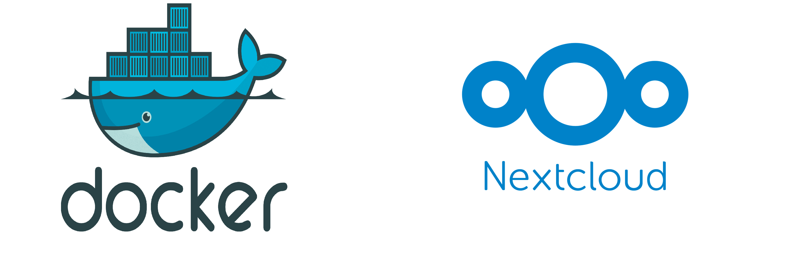

# 📂 PROYECTO INTERMODULAR: Nube Corporativa en Contenedores (Docker + Nextcloud + Backup)



- [📂 PROYECTO INTERMODULAR: Nube Corporativa en Contenedores (Docker + Nextcloud + Backup)](#-proyecto-intermodular-nube-corporativa-en-contenedores-docker--nextcloud--backup)
  - [1. 📋 Ficha Técnica del Proyecto](#1--ficha-técnica-del-proyecto)
  - [2. 🗓️ Cronograma Detallado (50 Horas)](#2-️-cronograma-detallado-50-horas)
    - [📅 SEMANA 1: Diseño y Arquitectura de Contenedores (10 horas)](#-semana-1-diseño-y-arquitectura-de-contenedores-10-horas)
    - [📅 SEMANA 2: Despliegue e Infraestructura (20 horas)](#-semana-2-despliegue-e-infraestructura-20-horas)
    - [📅 SEMANA 3: Pruebas de Desastre y Documentación (12 horas)](#-semana-3-pruebas-de-desastre-y-documentación-12-horas)
    - [📅 SEMANA 4: Defensa y Cierre (8 horas)](#-semana-4-defensa-y-cierre-8-horas)
  - [3. 📊 Rúbrica de Evaluación (Con Backup Bloqueante)](#3--rúbrica-de-evaluación-con-backup-bloqueante)
  - [4. 💡 Recursos y Comandos Clave para el Equipo](#4--recursos-y-comandos-clave-para-el-equipo)
  - [4. 💡 Elementos Diferenciadores (Para nota extra)](#4--elementos-diferenciadores-para-nota-extra)

## 1. 📋 Ficha Técnica del Proyecto

| Aspecto | Detalles |
| --- | --- |
| **Título** | Infraestructura de Nube Privada Dockerizada con Sistema de Backups Automatizado |
| **Duración** | 50 horas |
| **Equipo** | 3 alumnos (Roles: DevOps/SysAdmin, NetAdmin, Backup Operator) |
| **Módulos integrados** | Sistemas Operativos, Servicios de Red, Seguridad Informática |
| **Software principal** | **Docker & Docker Compose**, **Nextcloud**, **Duplicati** (Backup), MariaDB, Redis |
| **Hardware requerido** | 1 Servidor (Linux), 1 Disco secundario/USB (para destino de backups), 2 Clientes |
| **Cliente ficticio** | "Bufete de Abogados" (Requiere privacidad total y **garantía absoluta** de no perder datos) |

---

## 2. 🗓️ Cronograma Detallado (50 Horas)

### 📅 SEMANA 1: Diseño y Arquitectura de Contenedores (10 horas)

**Sesión 1-3: Análisis y Diseño de la Solución**

* **Reto:** El cliente exige que, si el servidor se quema, los datos se recuperen en menos de 1 hora.
* **Investigación Tecnológica:**
* Comparativa: Instalación nativa vs. **Docker** (Ventajas: portabilidad, facilidad de actualización).
* Estrategia de Seguridad: Uso de **Duplicati** para backups cifrados y versionados.


* **Roles:**
* *DevOps (Alumno 1):* Diseño del `docker-compose.yml` (Nextcloud + DB).
* *NetAdmin (Alumno 2):* Configuración de la red Docker (Bridge) y Reverse Proxy (Traefik o Nginx).
* *Backup Operator (Alumno 3):* Planificación de la estrategia de copias 3-2-1 con Duplicati.


### 📅 SEMANA 2: Despliegue e Infraestructura (20 horas)

**Sesión 4-5: Entorno Docker (El Corazón)**

* Instalación de Docker Engine y Docker Compose en el servidor Ubuntu.
* **Despliegue de Stack:** Creación y levantamiento del archivo `docker-compose.yml` que orqueste:
1. Contenedor **Nextcloud** (App).
2. Contenedor **MariaDB** (Base de datos).
3. Contenedor **Redis** (Caché para rendimiento).


* Gestión de volúmenes persistentes (para que los datos no mueran si se apaga el contenedor).

**Sesión 6: Configuración de Red y Acceso**

* Configuración del proxy inverso para acceder vía `nube.bufete.local` o IP pública.
* Implementación de certificados SSL (Let's Encrypt) dentro del contenedor o en el proxy.

**Sesión 7-8: Sistema de Respaldo OBLIGATORIO (Duplicati)**

* Instalación de **Duplicati** (puede ser otro contenedor o nativo en el host).
* **Configuración crítica:**
* *Origen:* Carpeta de volúmenes de Docker (donde están los datos de Nextcloud).
* *Destino:* Disco duro secundario o servidor FTP remoto.
* *Programación:* Incremental diaria a las 23:00h.
* *Cifrado:* AES-256 (Requisito del bufete de abogados).


### 📅 SEMANA 3: Pruebas de Desastre y Documentación (12 horas)

**Sesión 9: Simulacro de "Disaster Recovery" (Prueba de Fuego)**

* **Escenario:** El profesor "borra accidentalmente" un contenedor y su volumen de datos, o elimina archivos críticos de un proyecto legal.
* **Acción:** El equipo debe usar la interfaz de Duplicati para restaurar la versión del día anterior.
* *Si no logran restaurar los datos, el proyecto suspende automáticamente.*


**Sesión 10: Documentación Técnica**

* **Diagrama de Arquitectura:** Dibujo claro de cómo se conectan los contenedores.
* **Manual de Recuperación:** "Qué hacer si el servidor explota" (Paso a paso para restaurar con Duplicati).

### 📅 SEMANA 4: Defensa y Cierre (8 horas)

**Sesión 11-12: Presentación y Demo**

* Mostrar el panel de Docker (ej. Portainer o consola) viendo el consumo de recursos.
* Mostrar en vivo la restauración de un archivo borrado usando Duplicati.

---

## 3. 📊 Rúbrica de Evaluación (Con Backup Bloqueante)

Se ha ajustado la rúbrica para que la gestión de Docker y Duplicati sea el núcleo de la nota.

| Criterio | **10 (Avanzado)** | **7.5 (Intermedio)** | **5 (Básico)** | **0 (Necesita mejorar)** |
| --- | --- | --- | --- | --- |
| **Infraestructura Docker** | Stack completo (App+DB+Redis) desplegado con `docker-compose`. Volúmenes persistentes bien configurados y reinicio automático de contenedores (`restart: always`). | Despliegue en Docker funcional pero sin Redis o sin gestión correcta de reinicios automáticos. | Despliegue manual (sin docker-compose) o contenedores inestables que pierden datos al reiniciar. | No se logra desplegar Nextcloud o no funciona. |
| **Gestión de Backups (Duplicati) OBLIGATORIO** | Duplicati configurado con cifrado AES-256. Copias programadas automáticas. **Prueba de restauración exitosa y documentada.** | Duplicati instalado y configurado, pero la restauración presenta errores menores o no está cifrada. | Copia manual o script básico (`cp` / `rsync`) en lugar de usar Duplicati como se pidió. | **SUSPENSO AUTOMÁTICO:** No hay sistema de copias de seguridad funcional. |
| **Seguridad y Red** | Acceso HTTPS validado. Separación de redes (la DB no expuesta públicamente). Políticas de contraseñas fuertes. | Acceso HTTP funcional. Red básica. Seguridad estándar. | Problemas de acceso desde clientes externos o configuración de red insegura. | No hay conectividad de red. |
| **Documentación** | Incluye diagrama de contenedores, fichero `docker-compose.yml` comentado y Plan de Recuperación de Desastres (DRP). | Documentación correcta pero falta detalle en el plan de recuperación o en la explicación de Docker. | Documentación pobre, sin capturas del proceso de backup o configuración. | No se entrega documentación. |
| **Defensa y Demo** | Demostración fluida: "Borro archivo -> Restauro con Duplicati -> Aparece en Nextcloud". Dominio de comandos Docker. | Buena defensa, pero dudas al explicar cómo funciona la persistencia de datos en Docker. | Defensa leída, sin demostración práctica de la restauración. | No hay defensa o desconocimiento total de las herramientas usadas. |

---

## 4. 💡 Recursos y Comandos Clave para el Equipo

Para ayudar a los alumnos a arrancar con esta tecnología más avanzada:

**Ejemplo estructura `docker-compose.yml` simplificada:**

```yaml
version: '3'
services:
  db:
    image: mariadb
    volumes:
      - db_data:/var/lib/mysql
    environment:
      - MYSQL_ROOT_PASSWORD=secreto
      - MYSQL_DATABASE=nextcloud

  app:
    image: nextcloud
    ports:
      - 8080:80
    volumes:
      - nextcloud_data:/var/www/html
    environment:
      - MYSQL_HOST=db
      - MYSQL_PASSWORD=secreto

volumes:
  db_data:
  nextcloud_data:

```

**Por qué usar Duplicati en este proyecto:**

* A diferencia de un script simple, **Duplicati** tiene interfaz web, deduplicación (ahorra espacio) y sube copias a la nube (Google Drive, AWS, Mega) si el alumno quiere nota extra. Esto simula un entorno empresarial real.
---

## 4. 💡 Elementos Diferenciadores (Para nota extra)

Si el equipo quiere asegurar el **10 (Avanzado)**, se sugiere implementar uno de los siguientes extras:

1. **Integración Ofimática:** Instalar *Nextcloud Office* o *Collabora Online* para editar documentos tipo Word/Excel directamente en el navegador.
2. **Backup Externo:** Configurar un script que haga una copia de seguridad automática de la base de datos a un segundo disco duro o unidad USB a una hora programada.