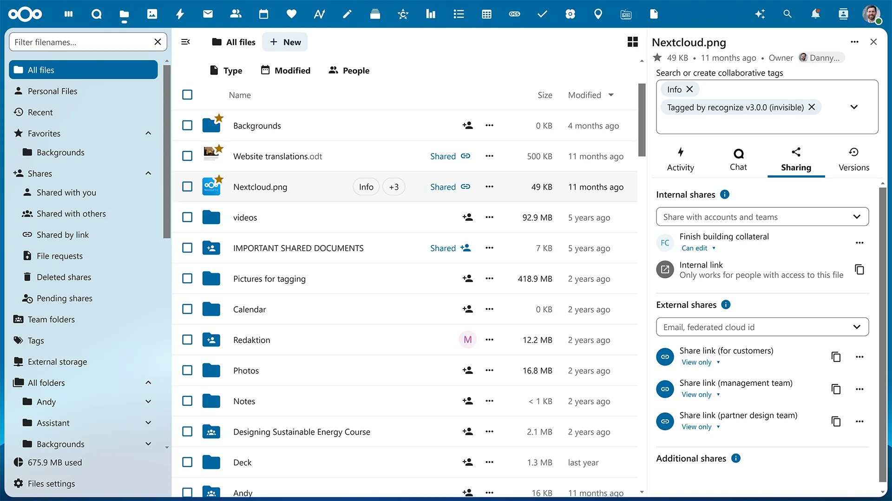

# 📂 PROYECTO INTERMODULAR: Nube Privada Corporativa (Nextcloud)

- [📂 PROYECTO INTERMODULAR: Nube Privada Corporativa (Nextcloud)](#-proyecto-intermodular-nube-privada-corporativa-nextcloud)
  - [1. 📋 Ficha Técnica del Proyecto](#1--ficha-técnica-del-proyecto)
  - [2. 🗓️ Cronograma Detallado (50 Horas)](#2-️-cronograma-detallado-50-horas)
    - [📅 SEMANA 1: Organización y análisis (10 horas)](#-semana-1-organización-y-análisis-10-horas)
    - [📅 SEMANA 2: Instalación y puesta en marcha (20 horas)](#-semana-2-instalación-y-puesta-en-marcha-20-horas)
    - [📅 SEMANA 3: Pruebas y mejoras (12 horas)](#-semana-3-pruebas-y-mejoras-12-horas)
    - [📅 SEMANA 4: Documentación y defensa (8 horas)](#-semana-4-documentación-y-defensa-8-horas)
  - [3. 📊 Rúbrica de Evaluación](#3--rúbrica-de-evaluación)
  - [4. 💡 Elementos Diferenciadores (Para nota extra)](#4--elementos-diferenciadores-para-nota-extra)
  - [📅 Información de Entrega y Modalidad](#-información-de-entrega-y-modalidad)

## 1. 📋 Ficha Técnica del Proyecto

| Aspecto | Detalles |
| --- | --- |
| **Título** | Sistema de almacenamiento y compartición de archivos en nube privada |
| **Duración** | 50 horas |
| **Equipo** | 3 alumnos |
| **Módulos integrados** | Sistemas Operativos, Redes Locales, Seguridad |
| **Software principal** | **Nextcloud** |
| **Hardware requerido** | 1 servidor, 2 equipos cliente, red local |
| **Cliente ficticio** | Estudio pequeño que necesita compartir archivos de forma segura |

---

## 2. 🗓️ Cronograma Detallado (50 Horas)

### 📅 SEMANA 1: Organización y análisis (10 horas)

* Analizar cómo trabaja el cliente y qué archivos necesita compartir.
* Explicar el objetivo del proyecto y repartir tareas entre los miembros.
* Diseñar la estructura de usuarios, carpetas y permisos.
* Preparar el esquema de la presentación final.

### 📅 SEMANA 2: Instalación y puesta en marcha (20 horas)

* Preparar el servidor con los servicios necesarios para Nextcloud.
* Instalar la plataforma y acceder desde un navegador.
* Crear usuarios de prueba y varias carpetas compartidas.
* Comprobar que los equipos cliente pueden entrar y usar la nube.

### 📅 SEMANA 3: Pruebas y mejoras (12 horas)

* Subir, descargar y compartir archivos entre varios usuarios.
* Probar un enlace público con contraseña.
* Realizar una copia de seguridad sencilla de la instalación.
* Mejorar la organización visual y revisar permisos básicos.

### 📅 SEMANA 4: Documentación y defensa (8 horas)

* Redactar la memoria técnica con capturas del proceso.
* Crear un manual breve para uso diario del sistema.
* Preparar una demostración real de compartición de archivos.
* Ensayar la exposición final.

---

## 3. 📊 Rúbrica de Evaluación

| Criterio | **10 (Avanzado)** | **7.5 (Intermedio)** | **5 (Básico)** | **0 (Necesita mejorar)** |
| --- | --- | --- | --- | --- |
| **Planificación** | El equipo organiza bien tareas, tiempos y objetivos desde el principio. | La planificación existe, aunque podría ser más clara. | La organización es básica y poco detallada. | No hay planificación visible. |
| **Montaje y funcionamiento** | La nube funciona correctamente y permite compartir archivos sin problemas. | El sistema funciona con pequeños fallos. | Funciona solo una parte del proyecto. | El sistema no funciona. |
| **Pruebas y uso real** | Se demuestra subida, descarga, compartición y copia de seguridad. | Se realizan pruebas básicas suficientes. | Las pruebas son escasas o poco claras. | No se prueban las funciones principales. |
| **Documentación** | Memoria y manual claros, ordenados y fáciles de seguir. | Documentación correcta, aunque mejorable. | Documentación muy breve o incompleta. | No se entrega documentación. |
| **Defensa** | Exposición clara, repartida entre todos y con buena demostración. | Presentación correcta con alguna duda menor. | Exposición poco preparada. | No se defiende bien el proyecto. |

---

## 4. 💡 Elementos Diferenciadores (Para nota extra)

1. Crear diferentes perfiles de usuario con permisos distintos.
2. Diseñar una estructura de carpetas clara para el cliente ficticio.
3. Mostrar una copia de seguridad básica o recuperación de un archivo.

---

## 📅 Información de Entrega y Modalidad

**Formato de entrega:** Los alumnos han de hacer una Exposición, donde han de grabarse a ellos mismos junto con la pantalla de su ordenador donde expongan el trabajo realizado durante el proyecto, máximo 10 minutos, preferiblemente menos.

**Fecha de entrega:** Mayo 29

**Modalidad:** Individual.

Los proyectos se presentarán la segunda semana de febrero y los alumnos pueden empezar a trabajar desde entonces una vez elegido los que van a realizar.

Es posible que los alumnos realicen su propia propuesta de proyecto pero ha de ser aprobada por el profesor antes de comenzar.
